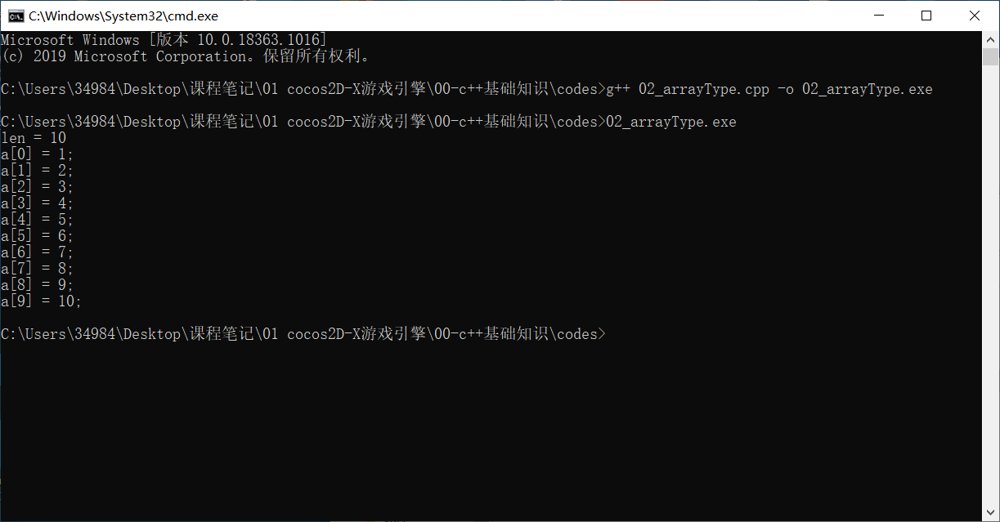
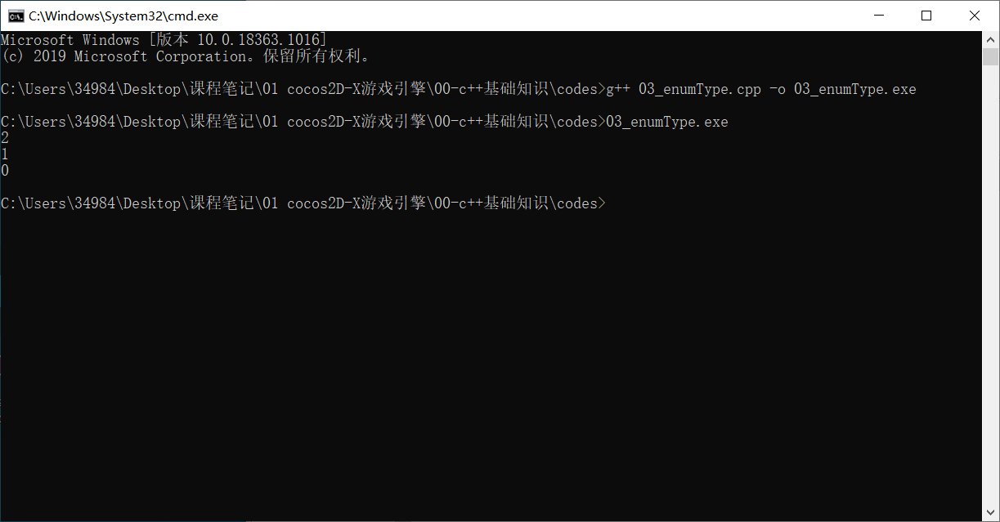

# 必备C++语言基础

- C++概述
- 第一个C++程序
- 数据类型、运算符和表达式
- 控制语句
- C++语言的面向对象特性
- 继承与派生
- 多态与虚函数

## C++的特点

* 类型检查更为严格;
* 增加了面向对象的机制;
* 增加了泛型编程的机制;如auto类型;
* 增加了异常处理;
* 增加了运算符重载;如,将加法推广至两个对标点的相加(原来只适用于数值类型);比如可以将加减乘除扩展到对象的加减乘除，就是用的重载的方式;
* 增加了标准模板库(STL): (cocos2d-x中会大量适用模板库，项目中介绍。cocos2d-x的库和标准模板库都可以供选用，具体情况具体分析。

* 模板库在cocos2d中大量运用，但是使用起来比较繁琐，所以需要后续逐渐熟悉，，基础课程中不会去讲解。

## 1.2 C++的扩展名

* C++允许访问C语言，可以用C++调用C语言的代码，如果有面向对象的内容，就要用.cc或者. cpp，c++中 可以用c++的和c的内容，所以用. cpp会更好。

* C里面也可以写object C的内容。

* 头文件中一般用于声明，在cpp文件中再加以实现。因此头文件在某种意义上看，可以当作帮助文档来看。

* 文件编码一般有utf-8和gbk， 尽量使用utf-8，通用于mac系统，不易出现乱码。

## 编写过程

```shell
在windows下安装Visual studio工具；/ linux、unix中可以gcc编译器；
#import  <iostream>  //<>和“”的不同。
int main(int argc, char const *argv[])
{
std::cout<<“Hello,World!\n”;
return 0;
}
在dos下编译：
Cl/Ehsc HelloWord.cpp    //使用记事本类的工具，如sublime text
Eclipse装c++插件就可以在各平台进行开发，但是配置起来比较麻烦，不推荐。
Mac或者ios中可以用xcode集成开发工具，用的主要也是c++的编译器gcc,新的版本可
能有的用的是苹果自己的编译器；
```

## 数据类型、运算符和表达式

基本数据类型:

* 整形: short int/int/long int跟机器的位数有关，不确定

- 浮点型:有float和double;可以加1ong或者long long ;普通的常数如3.2为双精度浮点，3. 2f为单精度浮点;

- char型:内存中存的是ascii,是整数,可以数学计算
- 布尔类型bool
- 派生类型:指针类型(*)、枚举类型(enum)、数组类型([])、结构体类型(struct) 、联合类型(union)、类类型(class)
  空类型void;

```c++
#include<iostream>
using namespace std;
int main(){
	int integerVar = 30;
	float floatingVar = 33.79;
	double doubleVar = 8.44e+3;
	char charVar = 'W';
	bool boolVar = true;
	cout<<"integerVar = "<<integerVar<<endl;
	cout<<"floatingVar  = "<<floatingVar<<endl;
	cout<<"doubleVar  = "<<doubleVar<<endl;
	cout<<"charVar = "<<charVar<<endl;
	cout<<"boolVar = "<<boolVar<<endl;
	return 0;
}
```


* **数组类型**

```c++
#include<iostream>
using namespace std;
int main(){
	int a[10] = {1,2,3,4,5,6,7,8,9,10};
	int len = sizeof(a)/sizeof(a[0]);
	cout<<"len = "<<len<<endl;
	for(int i=0;i<len;i++){
		cout<<"a["<<i<<"] = "<<a[i]<<";"<<endl;
	}
	return 0;
}
```



* **枚举类型**

```c++
#include<iostream>
using namespace std;
int main(){
	//枚举类型定义的一般形式为： enum  枚举类型名  { 枚举成员列表 };
	enum enumA{A1,A2,A3};//类型名也可放在后面，如：enum {A1,A2,A3}enumA;或者使用typedef来更名
	
	//枚举变量的方式
	enum enumA a1,a2,a3;//直接创建变量
	enum enumB{B1,B2,B3,B4} b1,b2,b3,b4;//在定义类型是创建变量
	
	//赋值和使用
	a1 = A3;
	a2 = A2;
	a3 = A1;
	cout<<a1<<endl;
	cout<<a2<<endl;
	cout<<a3<<endl;
	return 0;
}
```



* **结构体**

```C++
#include<iostream>
using namespace std;
int main(){
	//结构体可以看做轻量级的类，有三种定义方法:
	//方法1
	struct Student{
 	   const char* name;
 	   int age;
	};
	//访问代码如下:
	Student s;
	s.name="Tony";
	s.age=19;

	//方法2
	struct{
	    const char* name;
	    int age;
	}s1;//s1是临时变量，匿名结构体，只可以使用一次
	//访问代码为
	s1.name="Timmy";
	s1.age=20;

	//方法3
	typedef struct Student_{
 	   const char* name;
 	   int age;
	}student;
	//student是Student_的别名
	//访问代码如下：
	student s2;
	s2.name = "Tong";
	s2.age = 21;
	//打印
	cout<<s.name<<endl;
	cout<<s.age<<endl;
	cout<<s1.name<<endl;
	cout<<s1.age<<endl;
	cout<<s2.name<<endl;
	cout<<s2.age<<endl;
	return 0;
}
```


```c++
#include<iostream>
using namespace std;

union Student
{
	const char* name;
	int age;
}s1,s2;
int main() {
	s1.name = "Tony";
	s2.age = 18;
	cout << "Name = " << s1.name << endl;
	cout << "Age = " << s2.age << endl;
	return 0;
}
```


## 数据类型的转换方法

* 不同类型数据间可以按照下面的关系从左到右(从低到高)自动转换;
* bool、 char、 short int、 枚举类型- +long int- →- +long long int-→float→double→long double
* 强制类型转换:可能会有数据(精度)的丢失。

| 操作数1类型                                                  | 操作数2类型   | 转换后的类型  |
| ------------------------------------------------------------ | ------------- | ------------- |
| bool、char、short int 、枚举类型                             | int           | int           |
| bool、char、short int 、枚举类型、int                        | long int      | long int      |
| bool、char、short int 、枚举类型、int、long int              | long long int | long long int |
| bool、char、short int 、枚举类型、int、long int、long long int | float         | float         |
| bool、char、short int 、枚举类型、int、long int、long long int、float | double        | double        |
| bool、char、short int 、枚举类型、int、long int、long long int、float、double | long double   | long double   |

## 常量与变量

* 定义常量的方法：
  * const  double PI=3.1415926
  * 宏定义
  * 枚举类型
* 常量命名规范为：
  * 全大写，如果是由多单词构成，可以用下划线隔开，例如:const int YEAR, const int WEEK_OF_MONTH.
* 变量名命名规则是：
  * 必须是字母表中的一个字母、下划线和数字，不能有空格或者特殊字符，不能使用关键字；
  * 名称要反映该变量的用途，变量名一般全小写，而且一般为名词，例如length。
  * 驼峰命名方式(与匈牙利命名法有区别，自己百度一下)：多个单词，第一个单词小写，之后的每个单词第一个字母大写。如weekOfMonth，也有的把数据类型加进去，如intWeekOfMonth，或者当为成员变量是，可以在前面加上下划线。

## 位运算符

* 以“**a=1010（0xA)；b=1100(0xC)**"为例

| 表达式 | 结果               | 备注                       |
| ------ | ------------------ | -------------------------- |
| `a|b`  | 1110               | 只要有一个为1结果为1       |
| `a&b`  | 1000               | 两个数都是1，结果为1       |
| `a^b`  | 0110               |                            |
| `~a`   | ……1111111111110101 | 取反（有符号位时较复杂）   |
| `a>>2` | 10                 | 右移2位,高位用原有高位补位 |
| `b>>2` | 11                 |                            |
| `a<<2` | 101000             | 左移2位，低位用0补位       |
| `b<<2` | 110000             |                            |

```c++
#include<iostream>
using namespace std;
int main(){
	short int a = 0xA;
	short int b = 0xC;
	cout<<"a|b = "<<(a|b)<<endl;
	cout<<"a&b = "<<(a&b)<<endl;
	cout<<"~a = "<<(~a)<<endl;
	cout<<"a<<2 = "<<(a<<2)<<endl;
	cout<<"b<<2 = "<<(b<<2)<<endl;
	cout<<"a>>2 = "<<(a>>2)<<endl;
	cout<<"b>>2 = "<<(b>>2)<<endl;
	return 0;
}
```


## 控制语句(略)

## C++面向对象

- 面向对象的基本特征：
      **封装+继承(泛化/派生)+多态**
- 类声明
- 类的封装与访问限定符
- 构造函数
- 析构函数
- 静态成员
- 对象指针访问
- This指针
- 对象的动态建立和释放

> * 封装性：信息隐蔽,即尽可能隐蔽对象的内部细节,对外形成一个边界(或者说形成- -道屏障) , 只保留有限的对外接口使之与外部发生联系。
> * 继承性：特殊类对一般类的继承。例如：轮船、客轮；人、大人。一个类可以是多个一般类的特殊类它从多个一般类中继承了属性与服务，这称为多继承。例如,客轮是轮船和客运工具的特殊类。
> * 多态性：对象的多态性是指在子类中定义的成员被父类继承之后,可以具有不同的表现行为。这使得同一个成员一般类及其各个特殊类中具有不同的含义。例如: "几何图形“的“绘图"方法, "椭圆"和" 多边形"都是"几何图"的子类，其"绘图"方法功能不同。##

## 类的声明(无限定符，暂时不能访问，默认private)

```c++
#include<iostream>
using namespace std;
class Student{ //以class开头，可以放在.h的头文件中
	int age;//成员变量
	string name;//成员变量
	char sex;//成员变量：男male(m); 女female(f)
	public:
		void setData(int n,string str,char c){//成员函数
			age = n;
			name = str;
			sex = c;
		}
		void display();//声明成员函数
};
void Student::display(){//定义成员函数，可以放在.cpp中
	cout<<"[Student: {name:"<<name<<"; age: "<<age<<"; sex: "<<sex<<" }]"<<endl;
}
int main(){
	Student stu;
	stu.setData(19,"张三",'m');
	stu.display();
	return 0;
}
```

> 一般 什么时候将类的成员函数的声明和定义分开？
>
> * 成员函数的定义相对复杂的时候；
> * 不希望公开成员函数的时候；(.h文件是文本文件，是可以直接阅读的，而.cpp最后会生成执行的二进制文件)

## 类的封装和成员限定符

* 不能把类的全部成员与外界隔绝，一般是把数据（成员变量）隐蔽起来，而把成员函数作
  为对外的接口。
* 将Student类进行封装，它的声明修改如下：

```c++
class Student{
    private:
		int age;
		string name;
		char sex;
	public:
		void setData(int n,string str,char c){
			age = n;
			name = str;
			sex = c;
		}
		void display();
};
```

* 访问限定符：有public、private和protected，无顺序，也可以出现多次，默认情况下是private。
  * private限定的成员，只能被这个类本身访问;
  * public限定的成员，可以被所有的类访问;
  * protected声明的成员称为被保护的成员，它不能被类外访问,但可以被派生类的成员函数访问。

* 一般形式如下：

  >class 类名{
  >
  >​		private:
  >
  >​				私有的成员和成员函数
  >
  >​		public:
  >
  >​				公有的成员和成员函数
  >
  >​		protected:
  >
  >​				受保护的成员和成员函数
  >
  >}

## 构造函数

* 构造函数的名字必须与类名完全相同，编译器会据此识别并在实例化一个类时自动调用(无需人为调用)，以初始化类的成员变量；无
* 普通变量没有初始化问题不大，但野指针则可能导致大的安全问题。

```c++
#include<iostream>
using namespace std;
class Student{
	int age;
	string name;
	char sex;
	public:
		Student();//无参构造函数
		Student(int page,string pname,char psex);//含参数的构造函数
		
		void setData(int page,string pname,char psex){
			age = page;
			name = pname;
			sex = psex;
		}
		void display();
};
void Student::display(){
	cout<<"[Student: {name:"<<name<<"; age: "<<age<<"; sex: "<<sex<<" }]"<<endl;
}
//定义的无参数构造函数，如果不定义，会有一个默认的无参构造函数，只是啥也没做，函数体为空而己
Student::Student(){
	age = 0;
	name = "null";
	sex = 'M';
};

//定义的有参构造函数，与无参构造函数的关系是重载
Student::Student(int page,string pname,char psex){
	age = page;
	name = pname;
	sex = psex;
};
int main(){
	Student stu1;//调用无参构造函数
	stu1.display();

	Student stu2 = Student();//调用无参构造函数
	cout<<"stu2(before):\n\t ";//stu2修改值前
	stu2.display();
	cout<<"stu2(after): \n\t";//stu修改值后
	stu2.setData(19,"张三",'M');
	stu2.display();

	Student stu3 = Student(20,"李四",'F');//调用含参构造函数
	stu3.display();
	return 0;
}
```


## 析构函数

* 析构函数(destructor)也是一个特殊的成员函数，它的作用与构造函数相反，名字是类名的前面加-一个“~”符号;析构函数无参无返回值。
* 一般情况下，类的设计者应当在声明类的同时定义析构函数，以指定如何完成“清理”的工作，析构函数只有一一个，且都是自动调用(可能有触发，如delete) ;
* 如果用户没有定义析构函数，C++编译系统会自动生成-一个析构函数，但是它只是徒有析构函数的名称和形式，实际上什么操作都不进行。想让析构函数完成任何工作，就必须在定义的析构函数中指定。

---

* 什么时候调用：
  1. 如果在一个函数中定义了一个对象（自动局部对象），当该函数调用结束时，对象应该释放，在对象释放前自动执行析构函数；
  2. static局部对象在函数调用结束时，对象并不释放，因此也不调用析构函数，只是在main函数结束或者调用exit函数结束程序时，才调用static局部对象的析构函数；
  3. 如果定义了一个全局对象，则在程序的流程离开其作用域时(如main函数结束或调用exit函数)时，调用该全局对象的析构函数；
  4. 如果用new运算符动态地建立了一个对象，当用delete运算符释放该对象时，会先调用该对象的析构函数。

```C++
//在上面的代码中加入析构函数
~Student(){
	cout<<"~Student"<<endl;
}
```


## 静态成员

* 实现数据的共享和传递的两种方法：全局变量 or静态成员变量，静态成员变量对应的函数叫做静态函数；
* 有一个Account（银行账户）类，它有三个成员变量：amount（账户金额）、interestRate（利率）和owner（账户名）,在这三个数据成员中amount和owner会因人而异，不同账户这些内容不同，而interestRate所有账户都是相同的。
* 静态函数访问权限：只能静态成员变量，不能访问实例成员变量；
* 而实例函数能够访问：实例变量和静态变量。
* 静态变量和函数的访问：
* 可以通过类::静态变量(或静态函数)访问；
* 也可以通过对象.静态变量(或静态函数)访问

```c++
#include<iostream>
using namespace std;

class Account{
	private:
		double amount;
		string owner;
	public:
		static double interestRate;//静态变量定义
		Account(double pamount,string powner){
			amount = pamount;
			owner = powner;
		}
		
		static double getInterestRate(){//静态函数定义
			return interestRate;
		}
};

double Account::interestRate = 0.589;
int main(){
	Account account1 = Account(1000,"张三");
	cout<<"Account::interestRate = "<<Account::interestRate<<endl;//通过类::静态变量访问
	cout<<"Account::getInterestRate() = "<<Account::getInterestRate()<<endl;//通过类::静态函数访问
	cout<<"account1.getInterestRate() = "<<account1.getInterestRate()<<endl;//通过对象.静态函数访问
	cout<<"account1.interestRate = "<<account1.interestRate<<endl;//通过对象.静态变量访问
	
	return 0;
}
```


## 对象指针访问

* 可以定义一个指针变量，用来存放对象的指针，通过对象指针访问成员操作符是箭头->,它原本用来访问结构体中的成员使用的。

以上述的Student类为例，在main函数中这样操作：

```c++
int main(){
	Student stu1 = Student(19,"张三",'M');//创建实例stu1
	cout<<"stu1:\n\t";
	stu1.display();
	
	Student* stu2 = &stu1;//定义指向stu1的指针
	cout<<"stu2(point to stu1):\n\t";
	stu2->display();
	cout<<"stu2->setData(18,\"张三\",'M');"<<endl;
	stu2->setData(18,"张三",'M');//调用stu2的修改函数
	cout<<"stu2(point to stu1):\n\t";
	stu2->display();
	cout<<"stu1:\n\t";
	stu1.display();//发现stu1也被修改了

	Student* stu3 = new Student(20,"李四",'F');//动态建立
	cout<<"stu3:\n\t";
	stu3->display();//动态创建的指针不会自动调用析构函数，需要进行delete
	return 0;
}
```


## this指针：指向本类对象的指针。

用途1：在成员函数中区分自己的成员变量与传来的参数；

比如：

Student类的构造函数和修改数据函数可以换成如下代码：

```c++
Student::Student(int age,string name,char sex){//新·构造函数
    this->age = age;
    this->name = name;
    this->sex = sex;//使用this指针就能将自己的成员变量和参数变量区分开来
}
void Student::setData(int age,string name,char sex){//新·修改函数
    this->age = age;
    this->name = name;
    this->sex = sex//同上
}
```

## 对象的动态建立与释放

> 使用new算符动态建立对象，用delete运算符销毁对象，new和delete一般都在同一个函数中，用了new一定要用delete，否则就会造成内存泄漏。

* 所以在上述代码中stu3在建立后必须要delete进行释放

* ```c++
  Student* stu3 = new Student(20,"李四",'F');//动态建立
  cout<<"stu3:\n\t";
  stu3->display();//动态创建的指针不会自动调用析构函数，需要进行delete
  delete stu3;//释放stu3
  ```

可以发现stu3也调用了析构函数


## 继承与派生-继承的概念与声明

> 父类（基类）和子类（派生类）
>        Person类与Student类。


> **多重继承//D继承自A,B,C类，当父类之间有相似方法时，容易造成混淆
>     class D:A,B,C
>     {
>      类D新增加的成员
>      }**

```c++
class Person{//Person类
    public:
    	int age;
    	string name;
    	void display();
}

/*class Student{//Student类
    public:
    	int age;
    	string name;
    	string school;
    
    	void display();
}*/
class Student:Person{//继承自Person类
    string school;//除了继承Person的成员外，自己定义了一个school成员
}
```

## 继承与派生-派生类成员的访问

继承的方式分为：

1. 公有继承。基类的公有成员和保护成员在派生类中保持原有访问属性，其私有成员仍为基类私
   有。

   .png)

2. 私有继承。基类的公有成员和保护成员在派生类中成了私有成员，其私有成员仍为基类私有。

   

3. 受保护的继承。基类的公有成员和保护成员在派生类中成了保护成员，其私有成员仍为基类私
   有。保护成员不能被外界引用，但是可以被派生类成员访问。即：在main函数中访问保护成员函数时不可行的。

   

```c++
#include<iostream>
using namespace std;
class Person{//Person的定义-父类
	private:
		int id;
	protected:
		int age;
	public:
		string name;
		void display(){
			this->name = "Joy";
			this->id = 1;
			this->age = 18;
			cout<<"age:"<<age<<endl;
			cout<<"id:"<<id<<endl;
			cout<<"name:"<<name<<endl;
		}
};

//public继承的情况~类名PubStudent
class PubStudent:public Person{
	string school;
};

//protected继承的情况~类名ProStudent
class ProStudent:protected Person{
	public:
		string school;
		int getAge(){
			return this->age;//无法访问
		}
};

//私有继承的情况~类名PriStudent
class PriStudent:private Person{
	public:
		string school;
};

int main(){
	//公有继承的子类对象：
	PubStudent* pubstu = new PubStudent();
	pubstu->display();//各变量均可用
	delete pubstu;
	
	//protected变量只能在子类中访问。
	//保护继承的子类指针对象
	ProStudent* prostu = new ProStudent();
	//编译错误: 以下两句变量不能在main中访问。
	//prostu->display();
	//prostu->name;
	prostu->getAge();
	string proschool = prostu->school;
	delete prostu;

	//私有继承的子类指针对象
	PriStudent* pristu = new PriStudent();
	//pristu->display();//编译错误
	//string name = pristu->name;//编译错误
	string prischool = pristu->school;
	delete pristu;
	
	return 0;
}
```

## 派生类构造函数

* 调用构造函数的目的是初始化变量，派生类构造函数既要初始化新增的成员变量，还要初始化基类的成员变量，因此派生类的构造函数会调用基类的构造函数，具体调用哪一个构造函数取决于参数列表；
* 如果不定义派生类的构造函数，则有默认的构造函数，跟基类的构造函数相同。

* 派生类构造函数的一般形式为：
  * 派生类构造函数名(总参数表列):基类构造函数名(参数表列)
    {
       派生类中新增数据初始化语句
    }
  * 注意其中参数列表的对应顺序，要传递给基类的参数名
    要与派生类参数名相同。

```c++
class Person{
    private:
    	int age;
    public:
    	string name;
    Person(string name,int age){
        this->name = name;
        this->age = age;
    }
    void display(){
        cout<<"age:"<<age<<endl;
        cout<<"name:"<<name<<end;
    }
}
class Student:public Person{
    public:
    	string school;
    	Student(string school,string name,int age):Person(name,age){
            this->school = school;
        }
}
```

## 多态与虚函数-多态的概念

* 多态性：是指在父类中定义的成员函数被子类继承之后，在父类及其在各个子类中具有不同的表现形式。

* 编译时多态：通过函数重载完成
  * 函数重载是指在同一作用域内，可以用一组具有相同函数名，不同参数列表的函数，成为重载函数。减少了函数名的数量,提高了程序可读性。

* 运行时多态：通过虚函数完成
  * 不同的几何图形有不同的绘图方法，父类中定义虚函数(是只有函数声明，没有具体函数的定义),在不同子类中具体实现。

```c++
#include<iostream>
using namespace std;

void print(int i){
	cout<<"print a integer:"<<i<<endl;
}

void print(float j){
	cout<<"print a float:"<<j<<endl;
}

void print(string str){
	cout<<"print a string:"<<str<<endl;
}

int main(){
	//应该调用第一个print函数，如果第一个print函数不存在，会自动类型转化调用第二个print函数（类型是赋值兼容的）
	print(100);
	print("HELLOWORLD!");
	return 0;
}
```


## 多态与虚函数-虚函数

* 虚函数实例：函数结果不同
* 例如:“几何图形”类的绘图方法，在它的子类“椭圆形”和“三角形”中也都有“绘图”方法，但是“绘图”方法功能不同。


```c++
#include<iostream>
using namespace std;

class Graphics{
	public:
		virtual void onDraw1(){//按虚函数定义，则子类执行子类实现函数；
			cout<<"绘制图形"<<endl;
		}
		void onDraw2(){//按普通定义，则子类执行父类实现函数
			cout<<"绘制图形"<<endl;
		}
};

class Ellipse:public Graphics{
	public:
		void onDraw1(){
			cout<<"绘制椭圆形"<<endl;
		}
		void onDraw2(){
			cout<<"绘制椭圆形"<<endl;
		}
};

class Triangle:public Graphics{
	public:
		void onDraw1(){
			cout<<"绘制三角形"<<endl;
		}
		void onDraw2(){
			cout<<"绘制三角形"<<endl;
		}
};
int main(){
	Graphics *g1,*g2;
	g1 = new Ellipse();
	g2 = new Triangle();
	
	cout<<"按虚函数定义："<<endl;
	g1->onDraw1();
	g2->onDraw1();

	cout<<"按普通定义："<<endl;
	g1->onDraw2();
	g2->onDraw2();
	return 0;
}
	
```


## 虚函数的访问

虚函数的访问：

1. 通过基类指针，执行时会根据指针指向的对象的类，决定调用哪个函数。
2. 采用对象调用虚函数，则采用的是静态联编方式，它与基类指针访问是相反的。

```c++
int main(){
	Graphics *g1,g2;//定义基类指针和基类对象；
	g1 = new Ellipse();//指向一个new的椭圆类对象
	g2 = Triangle();//静态对象
	cout<<"g1：指针；g2：对象实例"<<endl;
	
	cout<<"\n按虚函数定义："<<endl;
	g1->onDraw1();//通过指针调用椭圆类的onDraw函数
	g2.onDraw1();//通过对象调用基类的onDraw函数

	cout<<"\n按普通定义："<<endl;
	g1->onDraw2();
	g2.onDraw2();
	return 0;
}
```


## 纯虚函数

* 纯虚函数：
  * 纯虚函数是指在基类中声明，但是没有定义的虚函数，而且设置函数值等于零。
  * 纯虚函数就是java里的抽象方法，只有声明，没有实现。
  * 纯虚函数的定义格式为：
         virtual   <函数类型>   <虚函数名称>  (<参数列表>)=0
  * =0就是纯虚函数，存在的意义就是让子类重写。

