# 一、Cocos2d-x 介绍与环境搭建

## 1. 第一个Cocos2d-x 游戏

### 1.1 创建工程

* cocos工具：命令工具cocos实现，cocos是使用Python脚本编写的，cocos工具的运行需要安装Python环境。
* 下载->安装->环境变量：把python的安装路径加到环境变量中。
* 进入一下目录，或者把该路径加入到path中也可以。


* 终端中执行如下指令：cocos new HelloWorld -p com.QinY.ctgu -l cpp -d D:/projects

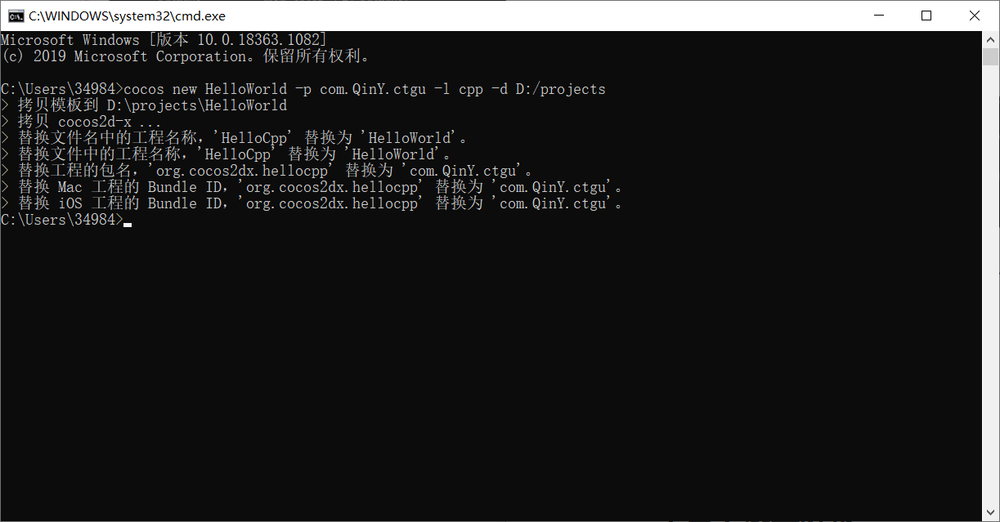

* 移植到Android平台是需要包名的，因为Android平台是通过包名来区分程序ID的，所以建立项目的时候必须要写包名
* 跨平台编译的时候还要ant等工具

### 1.2 工程文件结构

* 生产新工程文件的过程实际上是把模板等拷贝过去，但是不能硬性去拷贝。

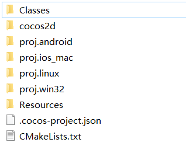

* proj.android、proj.ios_mac、proj.linux、proj.win32这四个文件夹都与平台有关，一直到时候要用的。
* **Class**: 开发时重点关注的代码；与工程文件里的内容相对应。
* Resources: 资源目录。
* cocos2d目录里是引擎

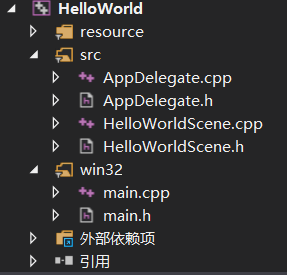

### 1.3 代码解释

* AppDelegate.cpp

  * 运行结果

    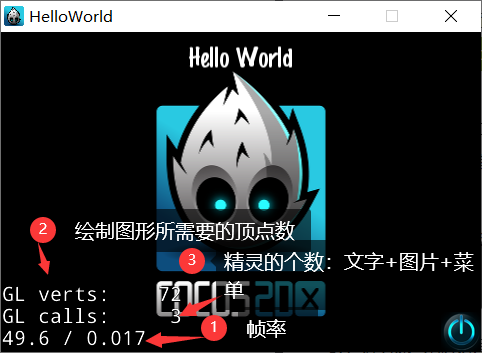

* AppDelegate类，为应用程序委托对象(类似c#) ;Delegate是一一种委托设计模式，作用是应用程序启动的时候会调用AppDelegate。

* 三个与游戏生命周期有关的函数：

  >  applicationDidFinishLauching(): 应用程序启动的时候会调用该函数

  * 初始化导演：Director::getInstance()
  * 初始化场景：HelloWorld::createScene()//创建场景
  * 场景跳转：runWithScene(scene)

  > applicationDidEnterBackground():程序退到后台时调用,如iphone手机点home键时;

  > applicationWillEnterForeground():从后台重新回到前台；如从任务栏重新点击它。

* director->setDisplayStats(false);

  * 是否显示帧率，调试阶段设置为true，而发布的时候设置为false，不显示；

* director->setAnimationInterval(1.0/60);//1秒钟刷新60次；

  * 设置帧率FPS，即每秒钟播放多少帧图片或者刷新场景的次数。

* auto glview = director->getOpenGLView();

  * 通过导演打开-一个OpenGLView,就是要将精灵等绘制到的OpenGL视图。在不同的平台下获得各自的视图(分辨率大小可能不同，与硬件有关)，而在win32下有一个默认的大小(960*640)， 可以根据需要改变在-一下代码中修改其值。

  ```c++
  if(!glview){
          glview=GLView::create("my game");
          //glview = GLViewImpl::create("game01");新版本
          //GLViewImpl是一个public继承自GLView的类
          director->setOpenGLView(glview);//此处可以设置glview的大小
  }
  ```

* auto scene=HelloWorld::createScene();

  * 事实上是创建了一个层及其所在的场景,并把层加到场景中。
  * Helloworld::createScene()的实际代码在HelloWorld.cpp中。实际上做的事情参考旧版主要语句可以理解为：
       auto scene=Scene::create();
       auto layer=HelloWorld::create();
       scene->addChild(layer);
       return scene;
  * director->runWithScene(scene);
    就是启动scene场景。

* // set OpenGL context attributes:设置opengl上下文属性； 
  red,green,blue,alpha,depth,stencil,multisamplesCount//红绿蓝alpha
  通道（透明相关）、
    GLContextAttrs glContextAttrs = {8, 8, 8, 8, 24, 8, 0};

* Depth：深度位数24；指一个像素中，每个颜色分量（Red、Green、Blue、Alpha通道）的比特数。

* Stencil：模板缓冲一般为8位，最大值为255；

* 深度测试和模板缓冲都可以用来确定绘制3D场景中，哪些部分对观察者可见。

* multisamplesCount：多采样技术,对边缘部分进行反走样,与抗锯齿属性有关。

* 启动场景时执行bool Helloworld::init()函数，在函数中初始化场景(旧版是初始化层)，然后在场景(层)中设置精灵、菜单、标签等等。

* 条件编译：当不满足条件的时候，就相当于把当前代码注释掉了。

## 2. Cocos2d-x 核心概念

### 2.1 导演

* 导演类Director（v3.0之前是CCDirector）用于管理场景对象。
* 获得导演类Director实例语句如下：
  * auto director = Director::getInstance();
* 单例设计模式在整个程序运行过程中只有一个实例，例如导演只能有一个。
* 单例也可以节省内存开销。
* 导演对象职责如下：
  * 访问和改变场景。
  * 访问Cocos2d-x的配置信息。通过导演读取用户信息。
  * 暂停、继续和停止游戏。
  * 转换坐标。

### 2.2 场景

* 场景类Scene（v3.0之前CCScene）是构成游戏的界面，类似于电影中的场景。

* 创建一个helloWorld层的类时，直接用引擎提供的场景类，不需要自定义场景类。

* 开发时更多的是自定义一些层，在层里进行开发。

  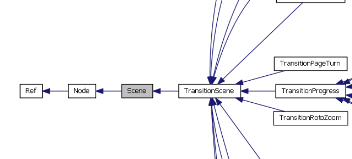

* 场景大致可以分为以下几类：

  * 展示类场景。播放视频或简单的在图像上输出文字，来实现游戏的开场介绍、胜利和失败提示、帮助介绍。
  * 选项类场景。主菜单、开始，停止、设置游戏参数等。
  * 游戏场景。这是游戏的主要内容。

### 2.3 层

* 层是我们写游戏的重点，我们大约99%以上的时间是在层上实现我们的游戏内容（重写层的init方法）。层的管理类似于PS中的图层，它也是一层一层叠在一起。

* 场景和层的关系可以一对一(推荐),也可以一对多。理论上来说,层越多需要绘制的深度越深越耗费CPU，层中的精灵等的绘制有互相遮挡的问题。

  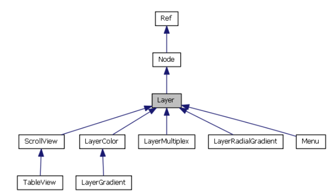

* 图形化开发工具如cocos studio 中将看到的东西封装成标准控件来使用。课程中不涉及。

### 2.4 精灵

* 精灵类Sprite(v3.0之前CCSprite)是游戏中非常重要的概念，它包括了敌人、控制对象、静
  态物体和背景等。

* 通常情况它会进行运动，运动方式包括了：移动、旋转、放大、缩小和动画等。

* 精灵的概念包含很广，可以是图片、label等等。前面讲层的那个背景也可以是精灵。

  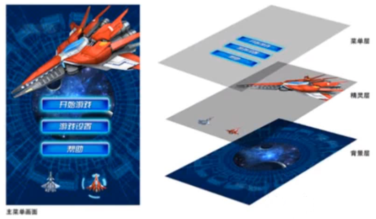

### 2.5 菜单

- 菜单在游戏中是非常重要的概念,它提供操作的集合,在Cocos2d-x中菜单类是Menu.
- 菜单的外观可以是多种形式，可能看起来就是一个图片,**图片精灵和图片菜单的区别**是：
  - 一个精灵想实现点击事情和手的触摸需要写一些事件处理代码；
  - 图片做成菜单则不用关注事件处理细节问题。

* Menu中包含菜单项MenuItem类,它有三个子类：
  * MenuItemLabel
  * MenuItemSprite
  * MenuItemToggle。

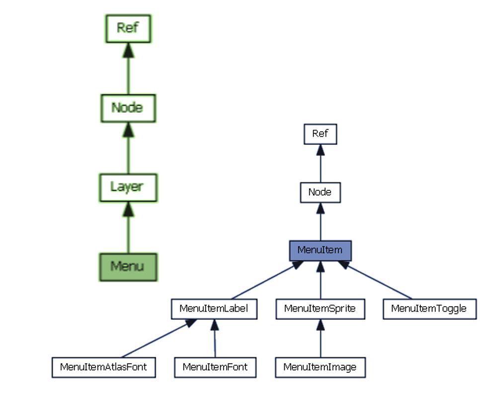


## 3. Node与Node层级架构

> addChild方法可以把子节点加入到父节点中。

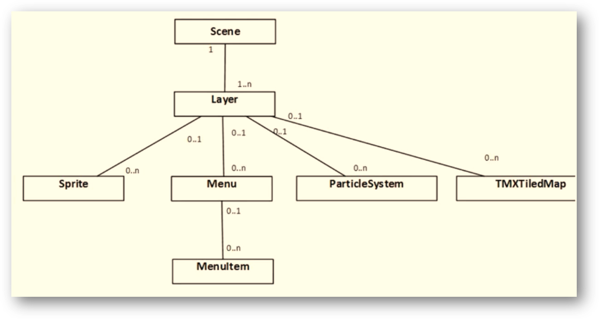

### 3.1 Node中重要的操作

---

* **创建节点。**Node* childNode = Node::create()。
  * 静态方法创建Node对象，一般很少使用，多是使用其子类如精灵类的创建。

* **增加新的子节点。**node->addChild(childNode, 0, 123)。
  * 参数1是要添加的node节点；
  * 参数2是添加的node的z轴顺序。我们用的是三维坐标，所以z轴的顺序不同，可能会相互遮挡，第二个参数越大，则离用户越近，就会遮挡前面渲染的内容，
  * 参数3是对node对象指定id(tag的值)，并通过id对node进行操作。

* **查找子节点**。Node* node = node->getChildByTag(123)。//通过tag查找子节点

---

* **node->removeChildByTag(123, true)**
  * 删除tag对应的子节点,并停止所有该节点上的一切动作。
* **node->removeChild(childNode) :**
  * 通过Node指针删除节点。
* **node->removeAllChildrenWithCleanup(true)**
  * 删除所有子节点,并停止这些子节点上的一切动作。
* **node->removeFromParentAndCleanup(true)**
  * 从父Node中删除节点,并停止所有该节点上的一切动作。

---

* 第四种
* Adds a child to the container with z order and tag.
* If the child is added to a 'running' node, then 'onEnter' and 'onEnterTransitionDidFinish' will be called immediately.
* Parameters
  * child ：A child node.
  * localZOrder ：Z order for drawing priority. Please refer to setLocalZOrder(int).
  * name ：A string to identify the node easily. Please refer to setName(int).

---

* 可以对照HelloWorld来讲。

* addchild 的四种函数重载

  * addChild[1/4]

    * ```c++
      virtual void addChild(Node* child);
      ```

  * addChild[2/4]

    * ```c++
      virtual void addChild(Node* child,int localZOrder);
      ```

  * addChild[3/4]

    * ```c++
      virtual void addChild(Node* child,int localZOrder,int tag);
      ```

  * addChild[4/4]

    * ```c++
      virtual void addChild(Node* child,int localZOrder,const std::string& name);
      ```

### 3.2 Node中重要的属性

* 两个重要的属性
  * **position(位置)**
  * **anchorPoint(锚点)**
* 位置是个相对概念,因为精灵是有大小的。
* 如图,锚点是0.5,0.5,代表是中心点，这个也是锚点的默认值。
* 锚点值其实是锚点离左下角距离占整个精灵大小的比例值。

> * **anchorPoint为(0.5,0.5)**
>
>   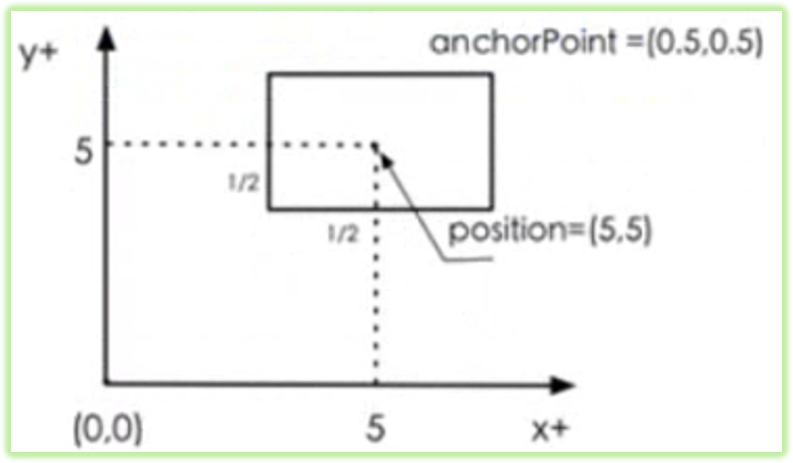
>
> * **anchorPoint为(0.0,0.0)**
>
>   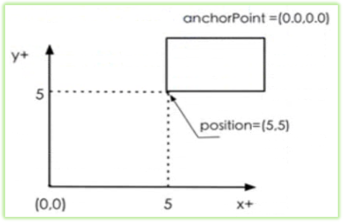
>
> * **anchorPoint为(1.0,1.0)**
>
>   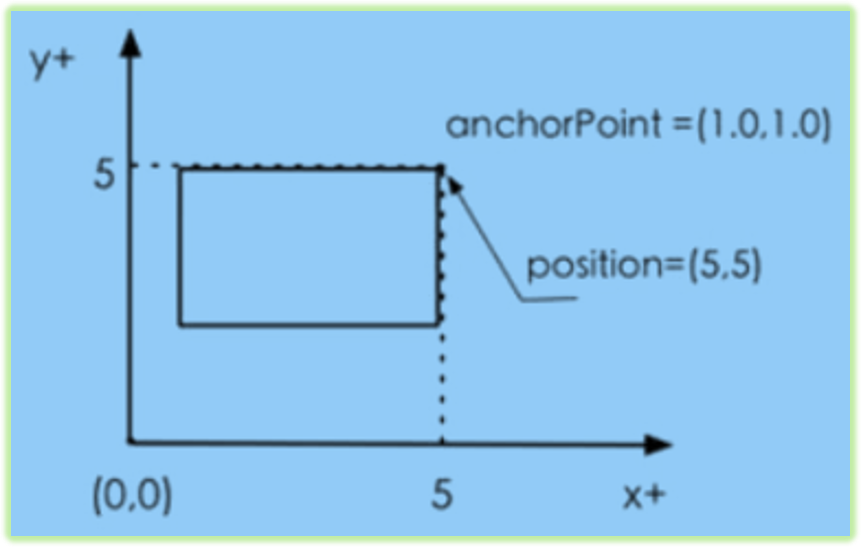
>
> * **anchorPoint为(0.66,0.5)**
>
> 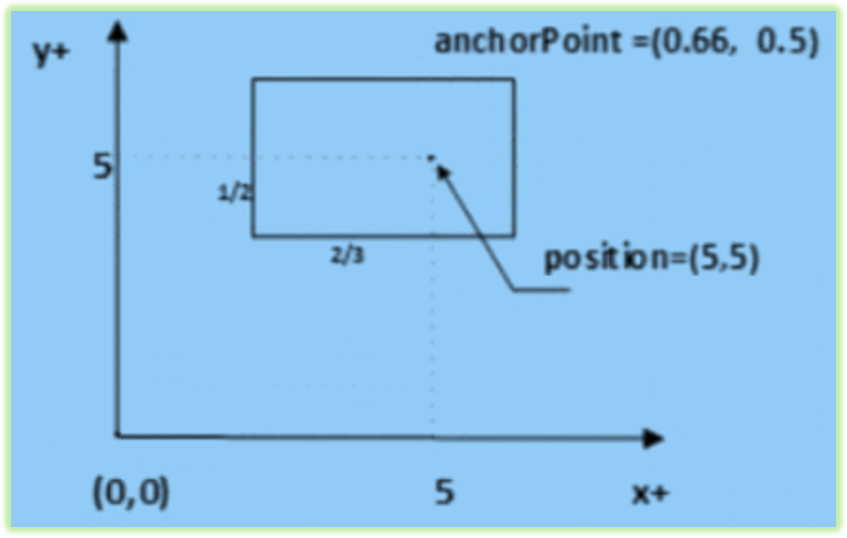

### 3.3游戏循环与调度

* 每一个游戏程序都有一个循环在不断运行，它是由导演对象来管理和维护。
* 如果需要场景中的精灵运动起来，我们可以在游戏循环中使用定时器(**Scheduler**)对精灵等对象的运行进行调度。
* 因为**Node类封装了Scheduler类**，所以我们也可以直接使用Node中调用函数。

* **Node中调用定时器函数主要有：**

  1. **void scheduleUpdate(void):**

     * 每个Node对象只要调用该函数，那么这个Node对象就会定时地每帧回调一次自己的update(float dt)函数。 dt是时间间隔。

     * 定义的帧率是1/60，所以调用update时间也是1/60,固定的函数的固定的时间间隔。

  2. **void schedule(SEL_SCHEDULE selector, float interval):**
     * 与scheduleUpdate函数功能一样，不同的是我们可以指定回调函数（通过selector指定），也可以根据需要指定回调时间间隔。

* **Node中调用停止定时器函数的方法主要有：**

  1. void unscheduleUpdate(void):
     * 停止update(float dt)函数调度。

  2. void unschedule(SEL_SCHEDULE selector):
     * 可以指定具体函数停止调度。
  3. void unscheduleAllSelectors(void):
     * 可以停止所有的调度。

## 4.Cocos2d-x坐标系

### 4.1 UI坐标和OPENGL坐标

* **下图是UI坐标，也叫视图坐标,原点在左上角**

  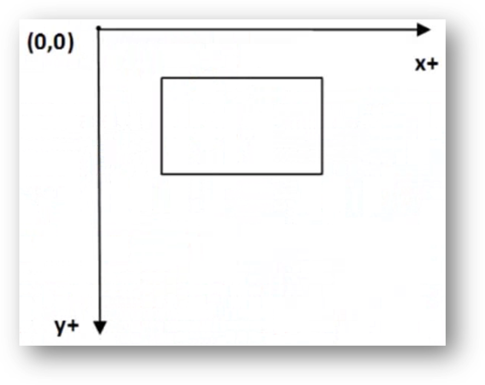

* OpenGL坐标就是Cocos2d-x默认坐标，它是一种3D坐标系。

* 底层使用OpenGL引擎速度比较快，所以采用OpenGL坐标。Z轴用的相对较少，用来表征绘制z轴的顺序；

* 原点在左下角。

  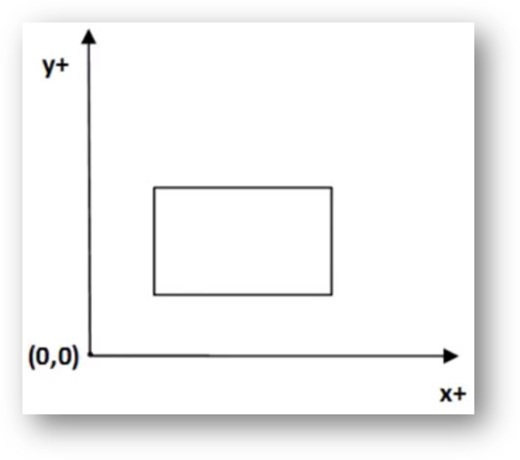

### 4.2 OPENGL坐标

* **从UI坐标到OpenGL坐标的转换：**

  * Vec2 touchLocation = touch->getLocationInView();//得到触摸点的位置，这个坐标其实是UI坐标系中的；
  * Vec2 touchLocation2 = Director::getInstance()->convertToGL(touchLocation);
    * touch是触摸点(Touch)对象

* OpenGL是右手坐标系，DirectX（微软）是左手坐标系。

* 3D坐标系中有**右手坐标系和左手坐标系**两种：

  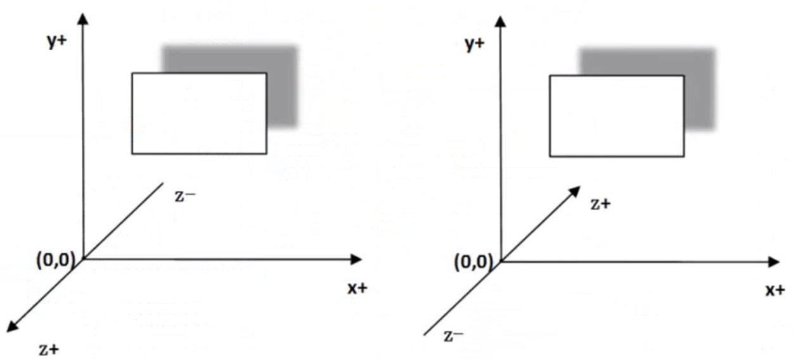

  > **右手坐标系**
  >
  > 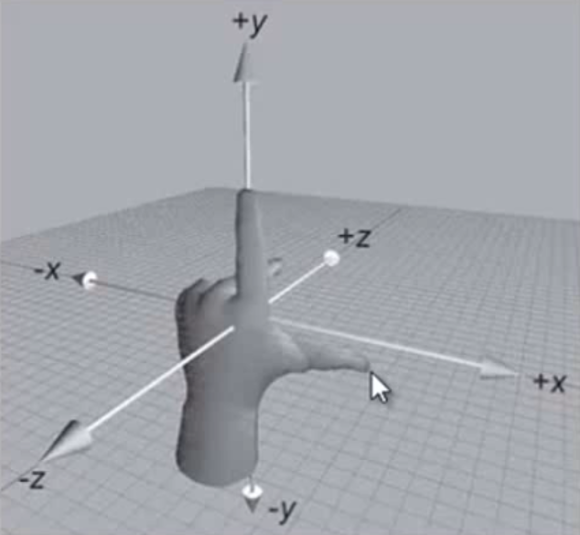

### 4.3 世界坐标和模型坐标

* 我们可以通过Node对象用如下函数实现世界坐标与模型坐标互相转换。
  1. Vec2 convertToNodeSpace(const Vec2& worldPoint):
     * 将世界坐标转换为模型坐标。
     * 没有AR表示参考NodeSpace的原点,有AR这参考NodeSpace的锚点。
  2. Vec2 convertToNodeSpaceAR(const Vec2& worldPoint):
     * 将世界坐标转换为模型坐标。AR表示相对于锚点。
  3. Vec2 convertTouchToNodeSpace(Touch * touch)。
     * 将世界坐标中触摸点转换为模型坐标。
  4. Vec2 convertTouchToNodeSpaceAR(Touch * touch)。
     * 将世界坐标中触摸点转换为模型坐标。AR表示相对于锚点。
  5. Vec2 convertToWorldSpace(const Vec2& nodePoint)。
     * 将模型坐标中触摸点转换为世界坐标。
  6. Vec2 convertToWorldSpaceAR(const Vec2& nodePoint)。
     * 将模型坐标中触摸点转换为世界坐标。AR表示相对于锚点。

### 4.4 世界坐标转换为模型坐标

* Node1和Node2大小也是300 x 100像素。

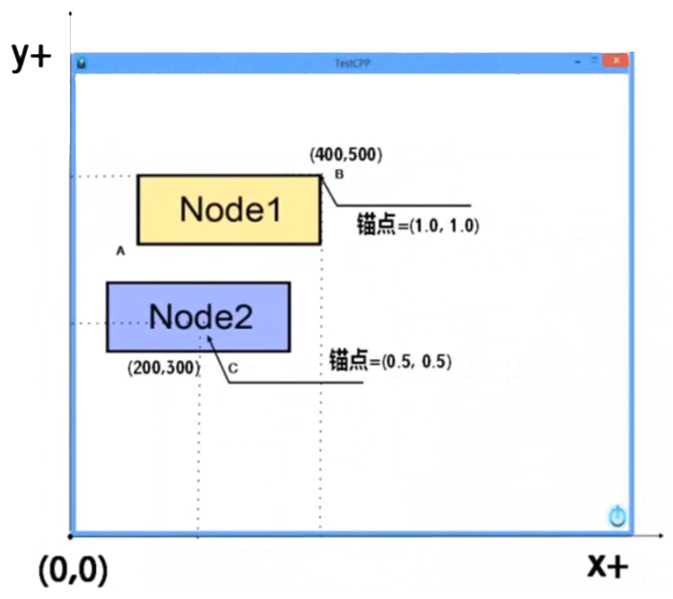

* 在游戏场景中有两个Node对象，其中Node1的坐标是(400, 500)，大小是300 x 100像素。Node2是放置在Node1中的，它对于Node1的模型坐标是(0, 0)，大小是150 x 50像素。

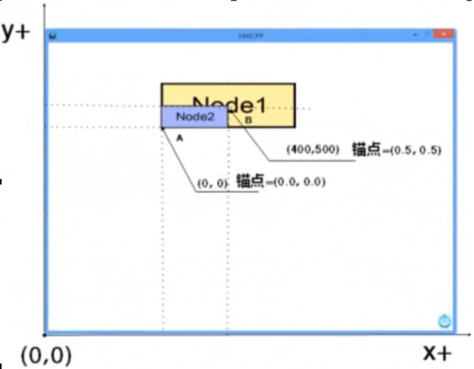

* **Node2的世界坐标转换为相对于Node1的模型坐标：**
  * Vec2 point1 = node1->convertToNodeSpace(node2->getPosition());
  * Vec2 point3 = node1->convertToNodeSpaceAR(node2->getPosition());

  .png)

* **结果：**

  * Node2 nodeSpace = (100.000000,-100.000000)
  * Node2 nodeSpaceAR = (-200.000000,-200.000000)
  * A(100, 400)
  * C(200, 300)
  * (100,-100)
  * B(400, 500)
  * (-200,-200)

  .png)

* **在Node2的世界坐标转换为相对于Node1的模型坐标：**

  * Vec2 point2 = node1->convertToWorldSpace(node2->getPosition());
  * Vec2 point4 = node1->convertToWorldSpaceAR(node2->getPosition());

* **结果：**

  * Node2 worldSpace = (250.000000,450.000000)
  * Node2 worldSpaceAR = (400.000000,500.000000)

  .png)

* **如果我们把Node2设置修改如下：**

  * node2->setPosition(Point(250,450));
  * node2->setAnchorPoint(Point(0.0, 0.0));
  * this->addChild(node2, 0);

  

## 5. Win32平台下设置屏幕

* Win32平台下设置屏幕的大小的方法：
  * glview->setFrameSize(900,640);
  * 说明：win32状况下不存在真正的横屏和竖屏的问题，只是对宽高比例的设置。

* 在AppDelegate.cpp中的对win32下屏幕进行设置：

* applicationDidfinishLaunching函数中：

  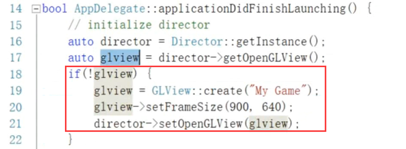

* Win32是模式环境，不存在底层硬件，所以第17行得到的glview是为空的，因此会运行18-21行代码，相当与手动设置win32中的屏幕大小和标题（在手机中都没意义）

# 二、Hello Cocos2d-x

